# Спецификация: Механизм импорта данных из CSV

## 1. Обзор

Цель — создать удобный функционал для администратора по массовому добавлению и обновлению данных о **винах**, **винодельнях** и **сортах винограда** через CSV-файлы непосредственно из интерфейса приложения на странице `/admin`.

## 2. UI и UX на `AdminScreen`

Страница администрирования будет содержать три независимых блока для каждой сущности.

### 2.1. Компоненты для каждой категории импорта

Для каждой категории (Вина, Винодельни, Сорта винограда) будет выделен свой `Card`-виджет, включающий:

1.  **Заголовок**: Например, "Импорт Виноделен".
2.  **Кнопка "Выбрать CSV-файл"**:
    *   При нажатии открывает системный файловый пикер.
    *   Фильтры должны быть настроены на `.csv` файлы.
    *   Используем пакет `file_picker`.
3.  **Отображение выбранного файла**:
    *   Под кнопкой будет `Text`, отображающий имя выбранного файла (`_selectedFileName`). Если файл не выбран, текст отсутствует.
4.  **Кнопка "Загрузить"**:
    *   Становится активной (`onPressed != null`) только после выбора файла.
    *   При нажатии запускает процесс импорта и переходит в состояние загрузки.
5.  **Индикатор прогресса**:
    *   Во время импорта кнопка "Загрузить" заменяется на `LinearProgressIndicator` с отображением процентов выполнения.
6.  **Область для отчета**:
    *   Под индикатором прогресса будет отображаться детальный отчет о результатах импорта.

### 2.2. Визуальная схема (Mermaid)

```mermaid
graph TD
    subgraph AdminScreen
        direction TB

        subgraph "Импорт Виноделен"
            A1[Кнопка: Выбрать wineries.csv] --> A2{Файл выбран?};
            A2 -- Да --> A3[Текст: wineries.csv];
            A3 --> A4[Кнопка: Загрузить];
            A2 -- Нет --> A1;
            A4 -- Клик --> A5[Индикатор: 0%...100%];
            A5 --> A6[Отчет о результатах];
        end

        subgraph "Импорт Вин"
            B1[Кнопка: Выбрать wines.csv] --> B2{Файл выбран?};
            B2 -- Да --> B3[Текст: wines.csv];
            B3 --> B4[Кнопка: Загрузить];
            B2 -- Нет --> B1;
            B4 -- Клик --> B5[Индикатор: 0%...100%];
            B5 --> B6[Отчет о результатах];
        end

        subgraph "Импорт Сортов Винограда"
            C1[Кнопка: Выбрать grape_varieties.csv] --> C2{Файл выбран?};
            C2 -- Да --> C3[Текст: grape_varieties.csv];
            C3 --> C4[Кнопка: Загрузить];
            C2 -- Нет --> C1;
            C4 -- Клик --> C5[Индикатор: 0%...100%];
            C5 --> C6[Отчет о результатах];
        end
    end
```



## 3. Процесс загрузки и обратная связь

### 3.1. Логика `DataImportService`

Сервис `DataImportService` должен быть модифицирован для поддержки следующих возможностей:

*   **Прием `Stream<List<int>>`**: Вместо `String csvContent` методы будут принимать стрим байтов файла для обработки больших файлов без полной загрузки в память.
*   **Прогресс в реальном времени**: Методы импорта должны принимать `ValueNotifier<double>` для обновления прогресса (от 0.0 до 1.0).
*   **Детальный отчет**: Возвращаемый `Map` должен содержать полную информацию для отображения в UI.

### 3.2. Отчет о результатах импорта

После завершения импорта (успешного или с ошибками) UI должен отобразить следующий отчет:

*   **Общая статистика**:
    *   `Всего строк в файле: 150`
    *   `Успешно обработано: 145`
    *   `Строк с ошибками: 5`
*   **Список ошибок** (если есть):
    *   Используется `ListView` или `Column` с прокруткой.
    *   Каждая ошибка отображается в формате:
        > **Строка 5**: Винодельня 'Неизвестная Винодельня' не найдена.
        > **Строка 12**: Неверный формат года '20-20'.
        > **Строка 28**: Отсутствует обязательное поле 'name'.

## 4. Обработка ошибок

Процесс импорта **не должен прерываться** при обнаружении первой ошибки. Сервис должен:
1.  Пропустить строку с ошибкой.
2.  Записать номер строки и причину ошибки в список.
3.  Продолжить обработку следующих строк.
4.  В конце вернуть полный список всех собранных ошибок.

## 5. Структура и формат CSV-файлов

### 5.1. `wineries.csv`
*   **Колонки**:
    *   `id` (опционально, `uuid`): Для обновления существующей записи. Если пуст, создается новая.
    *   `name` (обязательно, `text`): Название винодельни.
    *   `country_id` (опционально, `uuid`): ID страны.
    *   `description` (опционально, `text`): Описание.
*   **Пример**:
    ```csv
    id,name,country_id,description
    "a1b2c3d4-e5f6-a7b8-c9d0-e1f2a3b4c5d6","Массандра","...","Легендарная винодельня"
    ```

### 5.2. `wines.csv`
*   **Колонки**:
    *   `name` (обязательно, `text`): Название вина.
    *   `winery_name` (обязательно, `text`): Имя винодельни для поиска ее `id`.
    *   `vintage` (опционально, `integer`): Год урожая.
    *   `grape_variety` (опционально, `text`): Сорт или сорта через запятую.
    *   `color` (опционально, `text`, enum: `red`, `white`, `rose`).
    *   `sugar` (опционально, `text`, enum: `dry`, `semi-dry`, `semi-sweet`, `sweet`).
    *   `alcohol_level` (опционально, `numeric`).
    *   `image_url` (опционально, `text`).
*   **Пример**:
    ```csv
    name,winery_name,vintage,grape_variety,color,sugar
    "Мускат Красного Камня","Массандра",2020,"Мускат Белый",white,sweet
    ```

### 5.3. `grape_varieties.csv`
*   **Колонки**:
    *   `id` (опционально, `uuid`): Для `upsert`.
    *   `name` (обязательно, `text`): Название сорта.
    *   `description` (опционально, `text`): Описание.
    *   `origin_region` (опционально, `text`): Регион происхождения.
*   **Пример**:
    ```csv
    id,name,description,origin_region
    "b1c2d3e4-...","Каберне Совиньон","Самый распространённый сорт в мире","Бордо, Франция"
    ```

## 6. План реализации

1.  **[UI]** Обновить `AdminScreen`:
    *   Добавить `file_picker` для выбора CSV-файлов.
    *   Реализовать состояние для хранения выбранных файлов и статуса загрузки (`StateProvider` или `StateNotifierProvider`).
    *   Создать виджеты для отображения кнопок, прогресса и отчета.
2.  **[Service]** Модифицировать `DataImportService`:
    *   Изменить сигнатуры методов для приема `Stream` и `ValueNotifier`.
    *   Реализовать логику подсчета прогресса (например, `(обработанные строки / всего строк) * 100`).
    *   Улучшить возвращаемую структуру данных, включив в нее `totalRows`, `successCount`, `errorCount` и `List<String> errorDetails`.
3.  **[Controller]** Связать UI и сервис:
    *   В `AdminScreen`, при нажатии "Загрузить", вызывать соответствующий метод сервиса, передавая ему файловый стрим и `ValueNotifier`.
    *   Слушать изменения `ValueNotifier` для обновления `LinearProgressIndicator`.
    *   После завершения вызова отобразить полученный отчет в UI.
4.  **[Тестирование]** Подготовить тестовые CSV-файлы с корректными и некорректными данными для проверки всех сценариев.